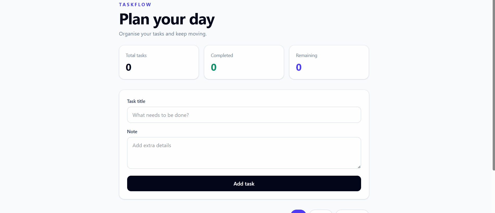

# 🚀 TaskFlow

A full-stack task management application that enables users to create, organise, update, and delete tasks through a responsive web interface. The project features a React frontend communicating with a FastAPI REST API backed by a PostgreSQL database, showcasing modern full-stack application development from local development to cloud deployment.

### Live Demo

**Application:** [https://taskflow-six-sandy.vercel.app/](https://taskflow-six-sandy.vercel.app/)

**API Documentation:** [https://taskflow-i5u3.onrender.com/docs](https://taskflow-i5u3.onrender.com/docs)

<br>


</div>

---
## Demo

<p align="center">
  
</p>

# Overview

TaskFlow is a task management web application that allows users to manage their daily tasks through a simple and responsive interface. Users can create new tasks, add optional notes, mark tasks as completed, and remove tasks they no longer need.

The frontend is built with **React** and **TypeScript**, while the backend exposes a **FastAPI REST API** that performs CRUD operations using **SQLAlchemy** and **PostgreSQL**. The application is containerized with **Docker** and deployed using **Vercel**, **Render**, and **Supabase**, following a production-style full-stack architecture.

---

# Features

- ✅ Create tasks
- ✅ View all tasks
- ✅ Mark tasks as completed
- ✅ Delete tasks
- ✅ Responsive React frontend
- ✅ RESTful API
- ✅ PostgreSQL database
- ✅ SQLAlchemy ORM
- ✅ Pydantic validation
- ✅ Docker containerization
- ✅ Backend API testing
- ✅ CRUD testing
- ✅ Cloud deployment

---

# Tech Stack

## Frontend

- React
- TypeScript
- Vite
- CSS

## Backend

- FastAPI
- SQLAlchemy
- Pydantic
- Uvicorn

## Database

- PostgreSQL (Supabase)

## Deployment

- Frontend → Vercel
- Backend → Render
- Database → Supabase

## Testing

- Pytest
- FastAPI TestClient

---

# Architecture

```text
                   React + TypeScript
                    (Vercel Frontend)
                            │
                            │ HTTP Requests
                            ▼
                  FastAPI REST API
                    (Render Backend)
                            │
                     SQLAlchemy ORM
                            │
                            ▼
                 PostgreSQL Database
                       (Supabase)
```

---

# Project Structure

```text
taskflow/

├── backend/
│
│   ├── app/
│   │   ├── routers/
│   │   ├── crud.py
│   │   ├── database.py
│   │   ├── main.py
│   │   ├── models.py
│   │   └── schemas.py
│   │
│   ├── tests/
│   │   ├── conftest.py
│   │   ├── test_api.py
│   │   └── test_crud.py
│   │
│   ├── Dockerfile
│   ├── requirements.txt
│   └── .dockerignore
│
├── frontend/
│   ├── src/
│   │   ├── api/
│   │   ├── components/
│   │   ├── types/
│   │   ├── App.tsx
│   │   └── main.tsx
│   │
│   └── package.json
│
└── README.md
```

---

# Live Deployment

| Service | URL |
|----------|-----|
| Frontend | https://taskflow-six-sandy.vercel.app/ |
| Backend API | https://taskflow-i5u3.onrender.com |
| Swagger Docs | https://taskflow-i5u3.onrender.com/docs |

> **Note**
>
> The backend is hosted on Render's free tier. If the application has been inactive, the first request may take around 30–60 seconds while the backend wakes up.

---

# API Endpoints

| Method | Endpoint | Description |
|---------|----------|-------------|
| GET | `/tasks` | Retrieve all tasks |
| POST | `/tasks` | Create a new task |
| PATCH | `/tasks/{id}` | Update a task |
| DELETE | `/tasks/{id}` | Delete a task |

Swagger Documentation

```
https://taskflow-i5u3.onrender.com/docs
```

---

# Running Locally

## Clone Repository

```bash
git clone https://github.com/alymkarim/taskflow.git

cd taskflow
```

---

## Backend

```bash
cd backend

python -m venv .venv

source .venv/Scripts/activate

pip install -r requirements.txt

python -m uvicorn app.main:app --reload
```

Backend

```
http://127.0.0.1:8000
```

Swagger

```
http://127.0.0.1:8000/docs
```

---

## Frontend

```bash
cd frontend

npm install

npm run dev
```

Frontend

```
http://localhost:5173
```

---

# Docker

Build backend image

```bash
docker build -t taskflow-backend .
```

Run container

```bash
docker run -p 8000:8000 taskflow-backend
```

---

# Testing

Run all tests

```bash
pytest
```

Run API tests

```bash
pytest tests/test_api.py
```

Run CRUD tests

```bash
pytest tests/test_crud.py
```

---

# Cloud Deployment

| Component | Platform |
|------------|----------|
| Frontend | Vercel |
| Backend | Render |
| Database | Supabase PostgreSQL |
| Containerization | Docker |

---

# Learning Outcomes

This project provided hands-on experience with:

- Building RESTful APIs with FastAPI
- CRUD application architecture
- SQLAlchemy ORM
- PostgreSQL integration
- API validation using Pydantic
- Unit and API testing with Pytest
- Docker containerization
- Environment variable management
- CORS configuration
- Frontend–backend communication
- Cloud deployment using Vercel, Render, and Supabase

---

# Future Improvements

- User authentication
- User-specific task ownership
- JWT authentication
- Password hashing
- Search tasks
- Task filtering
- Due dates
- Priority levels
- Dark mode
- Drag-and-drop ordering
- Docker Compose
- GitHub Actions CI/CD
- Alembic database migrations

---

# License

This project is licensed under the MIT License.
